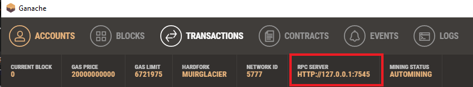
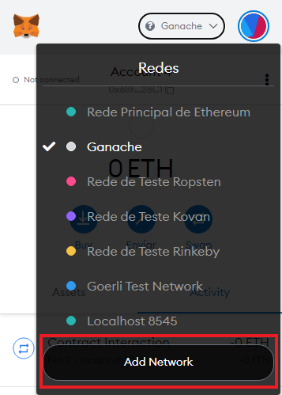
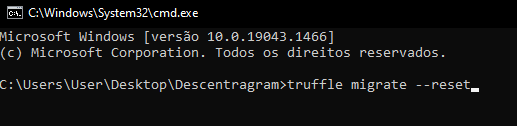
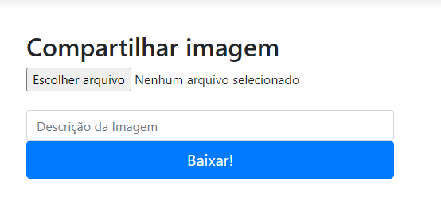
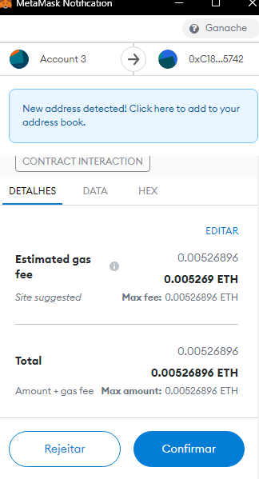
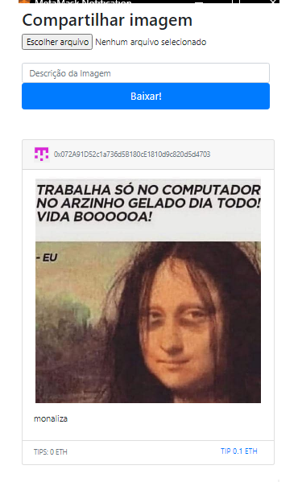

<h1 align="center">
 # Descentragram
</h1>

  <a href="#-tecnologias">Tecnologias</a>&nbsp;&nbsp;&nbsp;|&nbsp;&nbsp;&nbsp;
  <a href="#-projeto">Projeto</a>&nbsp;&nbsp;&nbsp;|&nbsp;&nbsp;&nbsp;
  <a href="#-layout">Layout</a>&nbsp;&nbsp;&nbsp;|&nbsp;&nbsp;&nbsp;
  <a href="#-como-executar">Como executar</a>&nbsp;&nbsp;&nbsp;|&nbsp;&nbsp;&nbsp;
  <a href="#-licença">Licença</a>

  

 

## ✨ Tecnologias

Esse projeto foi desenvolvido com as seguintes tecnologias:

- [React](https://reactjs.org)

## 💻 Projeto

Decentragram e um app que atravez de um smart contract de upload de fotos onde assinamos a transação via MetaMask 
e a imagem e enviada a carteira e exibida na tela.

## 🚀 Como executar

- Clone o repositório
- Instale as dependências com `npm install`
- Abra o terminal e inicie o servidor do seu editor [`VScode`](https://code.visualstudio.com/) com `npm run start`

Agora você pode acessar [`localhost:3000`](http://localhost:3000) do seu navegador.

Abra seu [`Ganache`](https://trufflesuite.com/ganache/) e conecte-se a [`MetaMask`](https://metamask.io/download/)
atravez do RPC Server 

  

  Abra sua MetaMask e escolha o servidor, entre em Add Network

  

## Dicas

- Adicione RCP URL da ganache e o chain ID
- Copie 2 chaves privadas do ganache e adicione em importar conta no MetaMask
- Abra o terminal e vicule o contrato a pagina usando o comando `truffle migrate --reset`

  

O home deve ficar assim

  

Agora já podemos "importar" imagens para a nossa carteira, após escolher o arquivo, assine a transação :

  

Atualize a página 😄

  

## 📄 Licença

Esse projeto está sob a licença MIT. Veja o arquivo [LICENSE](LICENSE.md) para mais detalhes.

---
# Lembrando que o conteúdo desse repositorio e apenas para apredizagem 

